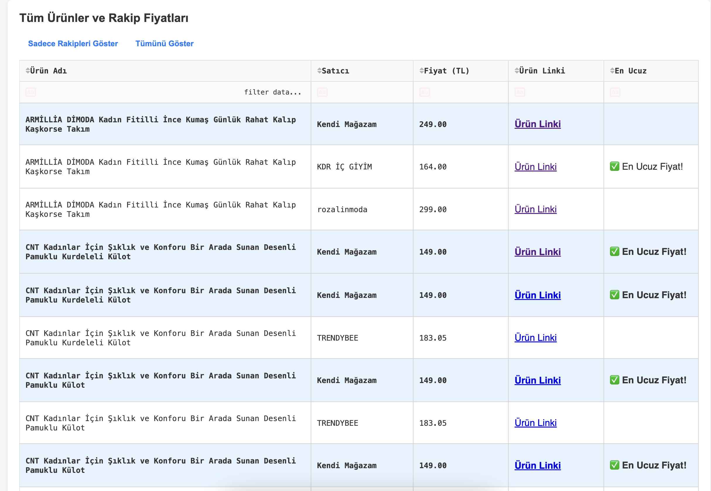

# Trendyol Rakip Fiyat Takip Paneli

Bu uygulama, Trendyol'daki kendi mağazanızın ürünlerini ve rakip satıcıların fiyatlarını takip etmenizi sağlayan bir kontrol panelidir. Selenium ve headless Chrome kullanarak Trendyol'dan veri çeker ve Dash ile görselleştirir.



## Özellikler

- Trendyol'daki ürünlerinizin otomatik olarak taranması
- Rakip satıcıların fiyatlarının çekilmesi ve karşılaştırılması
- Ürün fiyatlarının grafiksel gösterimi
- Ürün resimlerinin görüntülenmesi
- Tıklanabilir ürün bağlantıları (yeni sekmede açılır)
- Filtreleme ve sıralama özellikleri
- Verilerin yerel olarak saklanması
- Cloudflare korumasını aşmak için çerez desteği

## Kurulum

1. Repoyu klonlayın:
   ```
   git clone <repo-url>
   cd trendyol
   ```

2. Sanal ortam oluşturun ve aktifleştirin:
   ```
   python -m venv venv
   source venv/bin/activate  # Windows: venv\Scripts\activate
   ```

3. Gerekli paketleri yükleyin:
   ```
   pip install -r requirements.txt
   ```

4. `.env` dosyasını oluşturun:
   ```
   cp .env.example .env
   ```

5. `.env` dosyasını düzenleyerek Trendyol mağaza URL'nizi ve diğer ayarları ekleyin:
   ```
   TRENDYOL_SHOP_URL=https://www.trendyol.com/magaza/sizin-magazaniz-m-xxxxxx
   TRENDYOL_COOKIES=your_cookies_here
   PRODUCTS_FILE=products.json
   DATA_FILE=price_data.json
   COMPETITOR_DATA_FILE=all_competitor_prices.json
   DASHBOARD_PORT=8053
   ```

## Kullanım

1. Ürün verilerini çekmek için:
   ```
   python process_all_products.py
   ```

2. Dashboard'u başlatmak için:
   ```
   python app.py
   ```

3. Tarayıcınızda `http://127.0.0.1:8053` adresine gidin

4. "Verileri Güncelle" butonuna tıklayarak Trendyol'dan ürün verilerini güncelleyin

5. Dropdown menüden bir ürün seçerek fiyat karşılaştırma grafiğini görüntüleyin

### Farklı Mağazalar için Kullanım

Farklı mağazalar için iki yöntem kullanabilirsiniz:

1. `.env` dosyasındaki `TRENDYOL_SHOP_URL` değişkenini değiştirin:
   ```
   TRENDYOL_SHOP_URL=https://www.trendyol.com/magaza/baska-magaza-m-xxxxxx
   ```

2. Komut satırı argümanı kullanın:
   ```
   python process_all_products.py --shop-url="https://www.trendyol.com/magaza/baska-magaza-m-xxxxxx"
   ```

### Komut Satırı Argümanları

`process_all_products.py` scripti aşağıdaki komut satırı argümanlarını destekler:

- `--shop-url`: Mağaza URL'sini belirtir (`.env` dosyasındaki değeri geçersiz kılar)
- `--only-fetch`: Sadece ürünleri çeker, rakip fiyatlarını işlemez
- `--only-process`: Sadece mevcut ürünleri işler, yeni ürün çekmez
- `--limit`: İşlenecek maksimum ürün sayısını belirtir (örn: `--limit=10`)
- `--page-limit`: Taranacak maksimum sayfa sayısını belirtir (örn: `--page-limit=2`)

Örnekler:

```bash
# Belirli bir mağazadan tüm ürünleri çek
python process_all_products.py --shop-url="https://www.trendyol.com/sr?mid=109324"

# Sadece ilk 5 ürünü işle
python process_all_products.py --limit=5

# Sadece ilk 2 sayfayı tara
python process_all_products.py --page-limit=2

# Sadece ürünleri çek, rakip fiyatlarını işleme
python process_all_products.py --only-fetch

# Sadece mevcut ürünleri işle, yeni ürün çekme
python process_all_products.py --only-process
```

## Veri Dosyaları

Uygulama aşağıdaki dosyaları kullanır:

- `products.json`: Trendyol'dan çekilen ürünlerin listesi
- `price_data.json`: İşlenmiş ürün ve fiyat verileri
- `all_competitor_prices.json`: Rakip satıcıların fiyat bilgileri
- `product_data/`: Ürün JSON verilerinin saklandığı klasör

## Cloudflare Koruması ve Çerezler

Trendyol, Cloudflare koruması kullanır. Bu korumayı aşmak için:

1. Tarayıcınızla Trendyol'a giriş yapın
2. Tarayıcı geliştirici araçlarını açın (F12)
3. Network sekmesine gidin
4. Herhangi bir isteği seçin ve Headers sekmesinde "Cookie" değerini bulun
5. Bu değeri `.env` dosyasındaki `TRENDYOL_COOKIES` değişkenine ekleyin

## Dashboard Özellikleri

Dashboard aşağıdaki özellikleri sunar:

1. **Ürün Fiyat Karşılaştırması**: Seçilen ürün için tüm satıcıların fiyatlarını gösteren çubuk grafik
2. **Ürün Resmi**: Seçilen ürünün resmi
3. **Tüm Ürünler ve Rakip Fiyatları**: Tüm ürünlerin ve rakip satıcıların fiyatlarını gösteren tablo
   - Sütunlara göre sıralama
   - Filtreleme
   - Ürün linklerine tıklayarak yeni sekmede açma

## Sorun Giderme

1. **Cloudflare Hatası**: "Access Denied" hatası alırsanız, çerezlerinizi güncelleyin.
2. **Ürün Verisi Alınamıyor**: JavaScript ile veri çekme işlemi başarısız olursa, daha uzun bekleme süreleri deneyin.
3. **Dashboard Portu Kullanımda**: Port çakışması durumunda, `.env` dosyasındaki `DASHBOARD_PORT` değerini değiştirin.

## Teknik Detaylar

- **Selenium**: Web sayfalarını otomatik olarak taramak için kullanılır
- **Chrome WebDriver**: Headless tarayıcı olarak kullanılır
- **Dash**: Dashboard arayüzü için kullanılır
- **Plotly**: Grafik oluşturmak için kullanılır
- **Pandas**: Veri işleme için kullanılır
